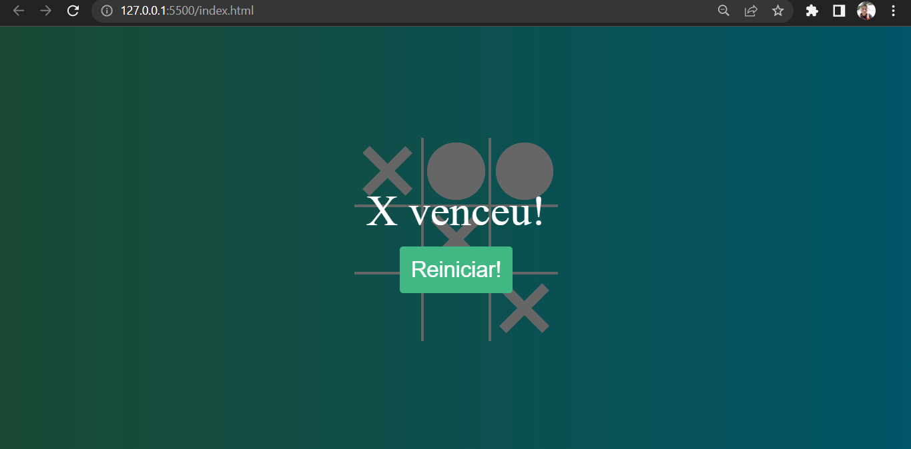
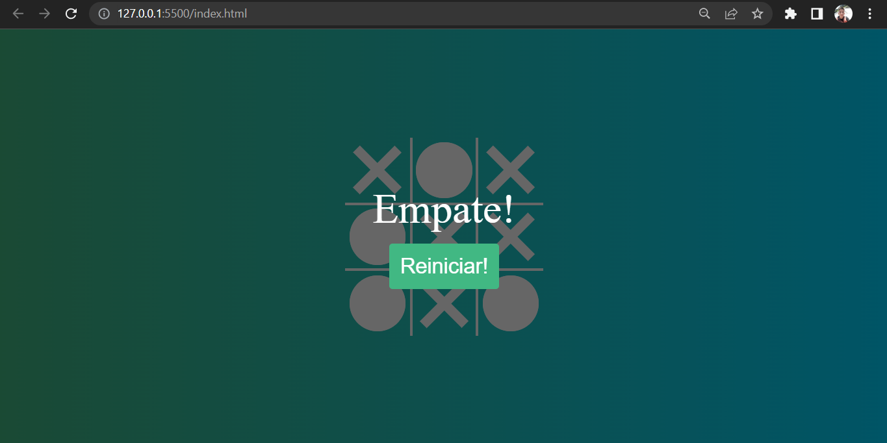

<h1 align="center"> Projeto -Jogo da Velha- </h1>

## 🚀 Tecnologias utilizadas

- HTML
- CSS
- JavaScript

## 💻 Sobre o Projeto

 

 
Esse projeto foi baseado em um jogo antigo chamado - Jogo da Velha -

    

 

 Foi feito um layout para embelezar o projeto e foi emplementado toda uma lógica 

--Vitoria 

   
 

 

--Empate

 

 By Diego Silva 

